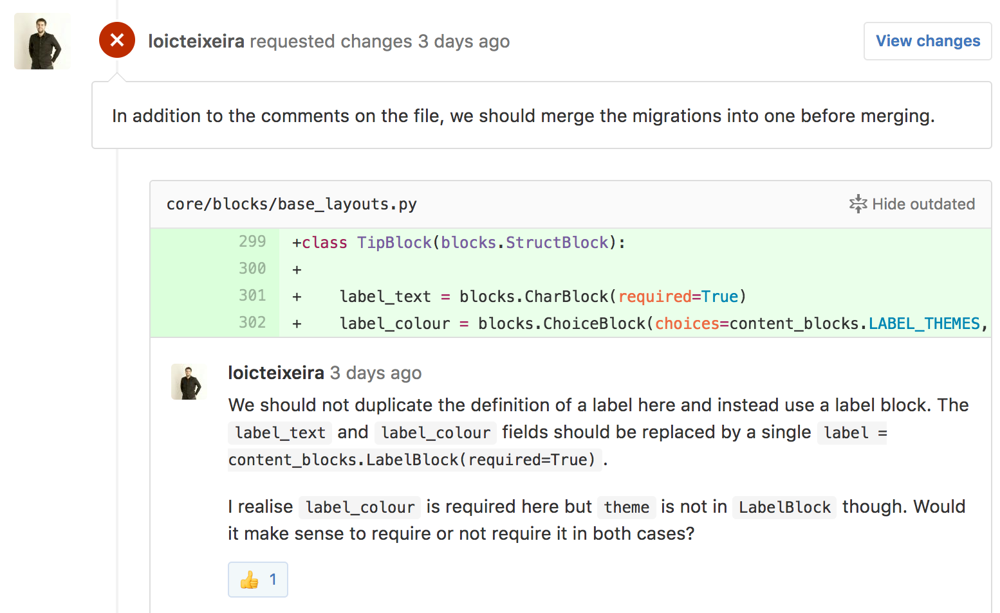
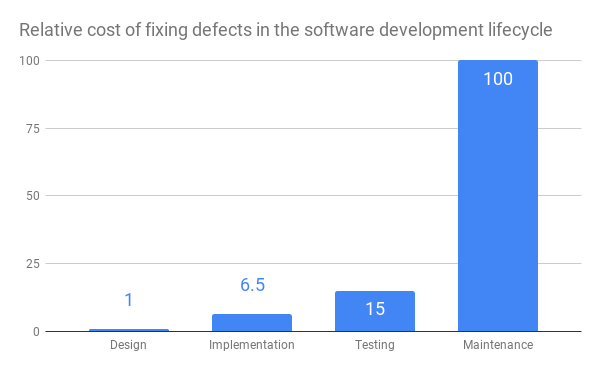
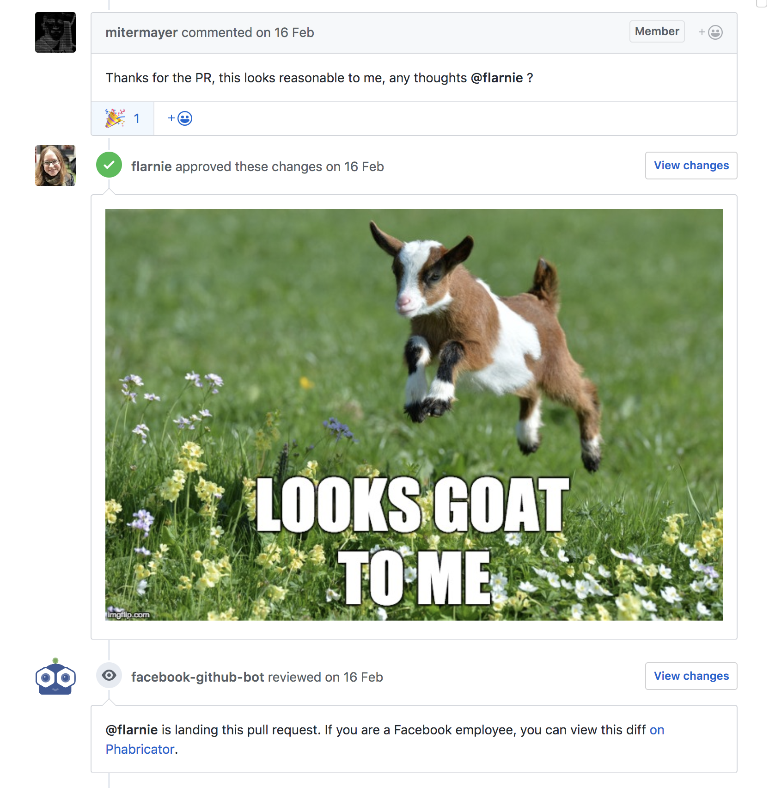

What if I told you there is this really straightforward technique to make your project run smoother, faster, and with fewer bugs 🤔. Better yet, it’s completely free, requires only minimal tooling, and any developer can learn to use it in a matter of minutes 😳. This is how good code reviews are, and why you should use them.

_Author: Thibaud Colas, Software Architect at Codemate Ltd._

---

## Why it’s good

Developers tend to think of productivity in terms of “how fast can I write the code for this new feature”. We also tend to say “I write code” when describing our jobs. In practice though, professional software development is a matter of understanding the code that is already there: we simply spend much more time reading than writing. Productivity thus depends more on the overall code’s quality and maintainability, rather than the skills of individual contributors making changes.

Simply put:

> **It’s harder to read code than to write it.**
>
> – [Joel Spolsky, Things You Should Never Do, Part I](https://www.joelonsoftware.com/2000/04/06/things-you-should-never-do-part-i/)

Code readability is fundamental. John Papa recently gave a talk on how to achieve it in practice:

<iframe width="560" height="315" src="https://www.youtube-nocookie.com/embed/56mETnrByBM" frameborder="0" allow="autoplay; encrypted-media" allowfullscreen></iframe>

Another great resource on the topic is [Code Reviews: Just Do It](https://blog.codinghorror.com/code-reviews-just-do-it/) by Jeff Atwood. If you like numbers, you should definitely read it. I especially like its excerpts from [Code Complete](https://www.amazon.com/exec/obidos/ASIN/0735619670):

> … software testing alone has limited effectiveness – the average defect detection rate is only 25 percent for unit testing, 35 percent for function testing, and 45 percent for integration testing. In contrast, the average effectiveness of design and code inspections are 55 and 60 percent. Case studies of review results have been impressive:
>
> In a software-maintenance organization, 55 percent of one-line maintenance changes were in error before code reviews were introduced. After reviews were introduced, only 2 percent of the changes were in error. When all changes were considered, 95 percent were correct the first time after reviews were introduced. Before reviews were introduced, under 20 percent were correct the first time.

That’s a 5x increase in the likelihood of individual changes to be correct! There aren’t many development practices which can make that claim.

### A great way to learn

Jeff Atwood’s article briefly mentions another reason why I think code reviews should be part of everybody’s toolset: you can learn A LOT from them. They are a great place for the team to share their knowledge and learn:

* How other people would approach and solve a given problem.
* General stylistic or architectural guidelines to follow for the specific project. Those are defined elsewhere (e.g. in a style guide or architecture principles document), but propagate well via code reviews.
* Neat programming tricks! For example using [list mapping (`Array#map`) over a mutable iteration (`Array#forEach` and `Array#push`)](https://github.com/roughike/inKino/issues/52).

_My friend [@loicteixeira](https://twitter.com/loicteixeira) does wonderful code reviews. Once he taught me about Python’s [mutable default arguments](https://stackoverflow.com/questions/1132941/least-astonishment-and-the-mutable-default-argument) during a review – they are a great way to learn platform-specific gotchas._

## Code reviews in practice

Sounds great on paper, right? 🌈

### Convince the boss

In practice, the first step is to “convince the boss”. Show them those great [metrics on the effectiveness of code reviews](https://blog.codinghorror.com/code-reviews-just-do-it/). Talk about how reviews improve [quality _in terms of business value_](https://www.codemate.com/quality-in-terms-of-business-value). Their main concern might be in the cost of having more people working on an otherwise identical amount of changes – this is a good time to talk about the economics of fixing software defects:

_Relative cost of fixing defects in the software development lifecycle. The later, the worse. Source: IBM System Science Institute._

### Get started with pull request reviews

With the business case taken care of, simply try code reviews for yourself! Every major Git platform has a pull request feature with built-in [review workflows](https://help.github.com/articles/requesting-a-pull-request-review/). If yours doesn’t, you can try doing code reviews in person instead, [pair programming style](https://en.wikipedia.org/wiki/Extreme_programming). No matter how you do it – start small, and see how it works out for you.

## Resources to get started

To give you a headstart in implementing code reviews for your teams, here are three things you will need:

1.  [Code review guidelines](https://github.com/CodemateLtd/cookbook/blob/master/CONTRIBUTING.md). We usually put those in a `CONTRIBUTING.md` file at the root of the project.
2.  [A pull request template](https://github.com/CodemateLtd/cookbook/blob/master/.github/PULL_REQUEST_TEMPLATE.md). This is where you state that the team does code reviews, that they will be enforced, and that pull requests should be authored accordingly. Ours is simple but gets the job done.
3.  [Useful resources about how to do this well](https://github.com/CodemateLtd/cookbook/blob/master/CONTRIBUTING.md). Code reviews are a solved problem, and there are great resources out there to take inspiration from.

Take all of these, sprinkle some LGTM ([Looks Good To Me](http://knowyourmeme.com/memes/lgtm)) images on top when approving changes, and you’re good to go. Code reviews can feel tense at times, those silly images set a more relaxed tone, and can ease the relationship between reviewers and reviewees. Plus, a nice picture is a great reward for good work!

You can find those images all over the internet, with Google’s Images search or with a service like https://www.lgtm.in/. Here is what it looks like in practice:

_Pro-level LGTM from Facebook’s @flarnie on the [Draft.js project](https://github.com/facebook/draft-js/pull/1652)_

## Taking it next level

If you want to invest in figuring out the best guidelines and workflow for your team, review those resources with your colleagues so you can have more informed conversations about your particular situation.

* [Code Reviews: Just Do It](https://blog.codinghorror.com/code-reviews-just-do-it/) by Jeff Atwood, my absolute favorite.
* The Flutter project has good [code review guidelines](https://flutter.io/design-principles/). I particularly like how they talk about the benefits of code reviews. This is a large-scale open-source project so their particular workflow might not fit perfectly for proprietary work, but still worth having a look.
* Karumi has really nice pull request guidelines and templates as part of their [project quality assurance guidelines](https://github.com/Karumi/project-quality-assurance). I would really like all the teams I’m part of to have such high-quality guidelines.
* Finally, Michael Lynch’s two-part article on [doing code reviews like a human](https://mtlynch.io/human-code-reviews-1/) is well worth a read, especially for its tips on effective team communication.

## Do it!

Still unsure? The best way to know whether code reviews will work for your team is to try them. All of the major hosted Git platforms have pull request features with code reviews built-in, you can try them out and see for yourself how many defects you will catch before they even get merged. At Codemate, a good example of this in practice is [my review of Iiro’s inKino project](https://github.com/roughike/inKino/issues/52). I didn’t catch any bugs, but we certainly all learned a lot 😄 – for me, [Flutter](https://www.codemate.com//considering-flutter), and for him a web developer’s perspective on UI code architecture.

If you want to learn more about how Codemate works, have a look at how we collaborate on our [software development recipes](https://github.com/CodemateLtd/cookbook/pull/1).
