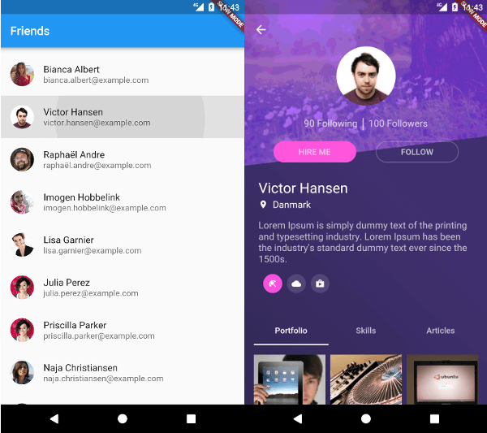
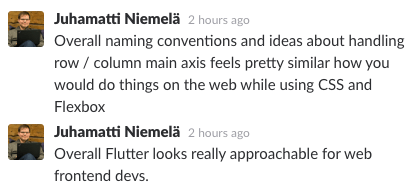
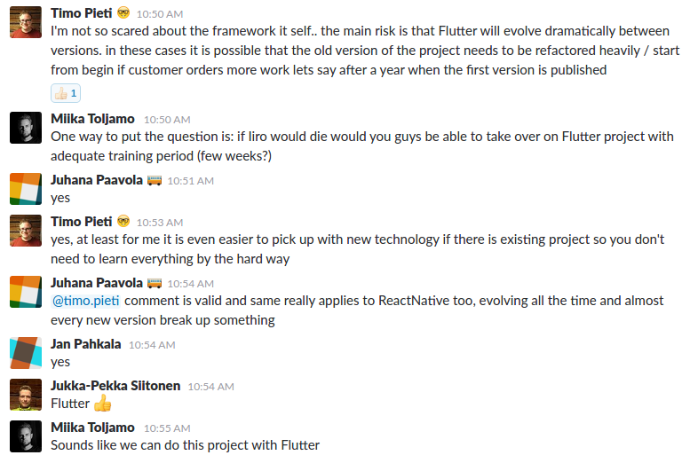

## Giving Flutter a go

> Most people, including me 4 months ago, don’t know what the heck Flutter is.

_Author: Iiro Krankka, iOS and Android Developer at Codemate Ltd._

---

## Yet another one of these frameworks

I accidentally stumbled upon **Flutter** when reading about Google’s Fuchsia. Hearing about Flutter being the _native SDK for Fuchsia_, I had to take a look.

I landed on the [Flutter home page](https://flutter.io/) and spotted the sales pitch:

> “Flutter is a new mobile app SDK to help developers and designers build modern mobile apps for iOS and Android.”

_Oh right, yet another one of these frameworks_, I thought. As a native mobile developer, I wasn’t really convinced by any of the existing cross-platform frameworks so far. The most promising until now was [React Native](https://facebook.github.io/react-native/), which I actually tried on a couple occasions.

## Let's at least give it a try

Having used only statically typed languages the last 5 years, the problem in React Native for me was the dynamic nature of Javascript. My incompetence with the build system, transpilers and webpack also didn’t help. I tried to setup TypeScript but had no luck there.

Also, coming from the early days of Android development, where [using enums was discouraged due to memory concerns](https://developer.android.com/topic/performance/memory.html#Abstractions), the approach of shipping **an entire Javascript runtime** and interpreting code on the fly seemed quite a hog for me.

Having kind of an “I’ve seen this before” feeling, I installed the Flutter SDK. Flutter used Dart on so-called Strong Mode, so I’d be getting the static typing I was used to. _There’s nothing to lose at least giving it a try_, I thought.

A solid 4 months later, after doing a lot with Flutter, here I am writing you about it.

## From tech-talk to a real talk

We here at Codemate are generally passionate about new technologies. A day doesn’t go by without someone posting something on our Slack about some new tech. That’s why we have our dedicated Slack channel for that, called **#tech-talk**.

A couple weeks ago, I stumbled upon an article called [What’s Revolutionary about Flutter](https://hackernoon.com/whats-revolutionary-about-flutter-946915b09514). I thought it was a great article, so I posted the link to our **#tech-talk** channel.

Little did I know what the consequences would be. Pertti, one of our software architects, read the whole article through. He was being a little skeptic at this point. Pertti thought Flutter seemed to be _almost too good to be true_.

I told Pertti that I’ve used it for a good 4 months, and it really is a great technology. This spurred some private conversation with him. He had a lot of questions about Flutter and I answered to him as well as I could.

After conversing with Pertti for a good 30 minutes, he dropped the bomb.

> “I just spoke to Lasse, our CPO. You’re hosting a company-wide Flutter presentation in a couple weeks.”

Fast-forward to yesterday, I was presenting my Google Slides to a little short of thirty people, including a handful of our software architects.

## The slides and source code

The first slides are a brief introduction to Flutter. Then they go through a sample app, breaking it into small sections.

 
Here are couple screenshots on how the sample app looks like:

The sample app consists of two screens: one being a list of random profiles loaded from an API, one being a profile details page.

All the source code for the [sample app is located here](https://github.com/CodemateLtd/FlutterMates).

## The reception

The presentation spurred up some great discussion. Admittedly, I presented some points about the Flutter Widget rendering in a confusing way. For that, I blame my nerves.

Our architects, which generally come from a web background, thought the presentation was good. I’m even seeing some interest in Flutter from their end.

Juhamatti, or “iiska”, is one of our go-to guys in web development related things. Ask anything web related and he knows. After the presentation, both him and Pertti said that it would be interesting to give Flutter a try.

## Can we actually use this?

I recently had a discussion with our Helsinki site manager about doing customer projects with Flutter. I really liked the answer, which was something along the lines of this:

> “I can’t give you a yes or no answer. Ask your mobile developer colleagues on Slack. We’ll decide based on that.”

At this point **I didn’t even care** if I got the green light or not. I felt it was such a _fair_ thing to do. So, I went ahead and asked the question on our **#mobdev** Slack channel.

That spurred a couple pages worth of discussion, with 5 yays and 1 nay. We reached to a democratic conclusion that can be seen here:

“If Iiro would die…” – that’s the typical Finnish attitude towards life. To weigh the pros and cons in something, we always **assume the worst**. I was ready to just get a “no” as an answer. I was met with a _stamp of approval_ from almost the whole mobile team instead.

In my experience from the last 4 months, Flutter is mature enough for making even complex apps. However, in its current state, it doesn’t fit every use case. For example, if you wish to use Bluetooth or need a full-fledged mobile database like Realm, you’re better off with something else. Unless you like to wait or create native plugins yourself, which you can totally do.

## Conclusion

If you haven’t, I encourage you to [try Flutter](https://flutter.io/setup/). As with any new technology, there’s some learning curve involved. Thankfully the developer experience is pleasant and the documentation is amazing. The Flutter team is being really helpful on their [Gitter group](https://gitter.im/flutter/flutter), Stack Overflow and GitHub issues. The [/r/FlutterDev](https://www.reddit.com/r/FlutterDev/) subreddit has plenty of helpful content coming every week.

For the use cases Flutter fits in, it matches and even outperforms its competition. Out of all these cross-platform frameworks, I really believe [Flutter could be the One](https://www.youtube.com/watch?v=sIIgtClYq0s).
