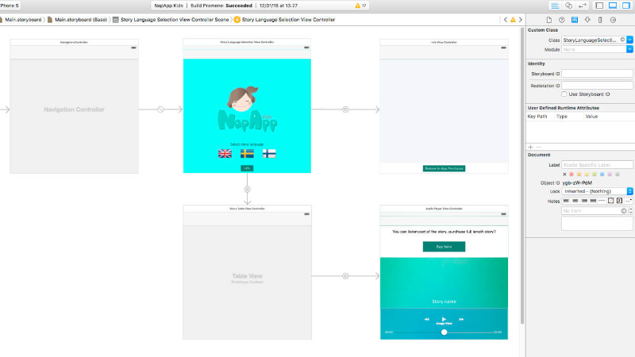

# Shift to iOS

For several years now I’ve been working on application development for Android platform. I know the platform pretty well, since the projects I have participated in have required quite a wide variety of Android features. It’s fun to do things with the technologies you know well. But it’s good to **get outside your comfort zone** and learn something new.

A few months ago there was a need for iOS development at Codemate. Learning iOS was one of the main things that had been added to my personal development plan with the employer and this was a good opportunity to hop into it. I had participated in an iOS development course some time ago and done some small training projects on it. Objective C language was also somewhat familiar to me.

**On this blog post I’ve written my experiences on moving from Android development to iOS.**

---

Author: Jukka-Pekka Siitonen, Software Engineer at Codemate Ltd.

## From Android Studio to XCode

When I started Android development, the development environment (IDE) was [Eclipse](https://eclipse.org/ide/) which I used on other Java projects as well. Then Google made developers move the Android projects to [Android Studio](https://developer.android.com/studio/index.html). I found that a major upgrade, Android Studio being more stable and a better IDE overall for this purpose.

When starting with iOS development, first thing that I needed to get familiar with was [XCode](https://developer.apple.com/xcode/ide/) and all its shortcuts. It’s quite a deep learning curve but manageable. Application project configuration seemed somehow clearer in Xcode if compared to an Android Studio project which is mix of files you just need to know first ( f.e manifest and gradle build definitions). Xcode UI for project management is more intuitive. Handling application info and capabilities are clearer than in Android projects.

## Project structure and UX dev

From Android development experience I was familiar with UI definition style in XML and how all the app resources are defined under the organized res-folder. Although it required thorough knowledge in the application code and the UI flow, I was happy with using the resources in Android projects and because of that it was a thing to miss while jumping into the world iOS and Xcode.

After a short while, I noticed a massive boost in UI development convenience when using **storyboards**. Here’s a pretty good [tutorial](https://www.raywenderlich.com/113388/storyboards-tutorial-in-ios-9-part-1) on storyboards, scenes and segues. Storyboard provides a main application flow even if you’re not familiar with the app itself i.e it is developed by other developer. It’s a great way to organize the UI visually, with less code written manually.

As a side effect, if the iOS project is based on an old version of iOS, there is not necessary a storyboard and the UX side is built with code and xib-files, the idea being similar to Android with xml layout files. These older apps may require UI porting into storyboards, which doesn’t seem like a walk in a park.

## UI definitions and missing layouts

The UI definitions seem to have quite a similar style between the platforms. However there is a one magical word that sets them apart: **Constraints**. While building the UI you will most likely face constraints, which are relative dimensions of the UI elements. After my experience it is one of the highest speed bumps while moving from Android to iOS, if not counting totally different coding languages.

As I was familiar with Android’s ready-to-use layout container system, I really missed that in iOS development. iOS development is based on constraints and setting up dimensions between UI components and the view. I needed to force myself to do a paradigm shift.

There is also a massive difference with provided UX components between the platforms. There is a huge set of ready-to-use UI components on Android side, but totally missing some of them in iOS. Sure, they have their own. However, it is relatively easy to start using external libraries & ui components in both cases.

## External libraries

To set up external libraries into Android projects I used [Gradle](https://developer.android.com/studio/build/index.html) build system and dependency definitions which were quite clever and easy to handle. Basically, I just defined a library which will was loaded to the current Android project. Nowadays Gradle is the default tool for this, included in the Android Studio.

The equivalent tool in iOS development is [CocoaPods](https://cocoapods.org/). Getting CocoaPods running for the first time felt a bit complicated, but it is quite a simple tool to use after the first configuration is set up correctly.

## Building and running apps

Building for Android is usually quite straightforward process: just select the device and build.

The steps are the same with iOS but there is one major advantage: building and running a simulator is a lot faster than on Android. However, Google just provided a totally new emulator version and it looks promising.

**Building for release** is profoundly different between the two platforms. When building for Android it is a lot easier. It requires only a few steps of signing a package with a valid keystore. In most cases you’re able to test release the package with any Android powered device. With iOS I needed to do a lot of configuration with the the Apple account, application provisioning profiles, devices etc. Xcode tries to tell if something is missing or misconfigured and sometimes it could fix them too, but I wouldn’t hold my breath with that. 😉

## Conclusions

Development for iOS felt first a little tricky due to the deep learning curve faced immediately when building apps with Android development background. Even when I had a some basic knowledge in iOS development from past and had attended an iOS development course, it required study on what things had changed between the iOS versions and tools from those days. Probably the biggest thing was getting used to Objective-C coding syntax after java.

Next step for me will be iOS development with Swift.

---

**[Join our newsletter](http://eepurl.com/bSndMf) to get a wrap-up of the stories we produce. Maximum once per month.**
