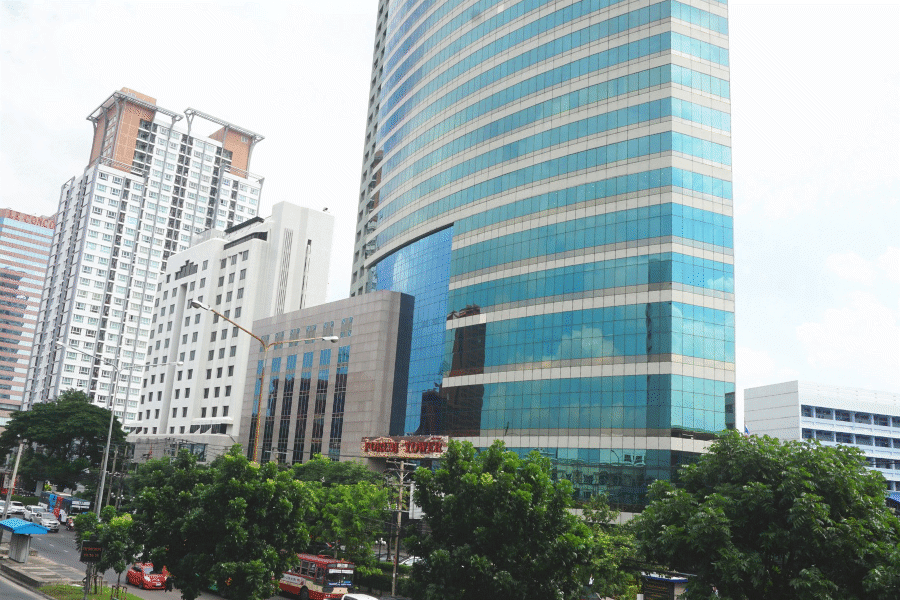

## Eastern connection

Codemate is actively promoting cooperation with Finnish companies operating or entering South-East Asian markets.

We have been present in S-E Asia for years and have grown our local team in Bangkok, which consists mainly of Finnish software experts. There’s a lot of business to be done in Bangkok, but take note that it’s only a short flight from Singapore and Hong Kong as well.

We can help in delivery projects for local clients as well as developing specific software solutions for production sites in the area.

## Why to collaborate?

To better serve your customers in South-East Asia.
To increase operational efficiency on your production sites there.

You have immediately a capable multidisciplinary software team on your disposal, close to the delivery site. We understand the local businesses and the users of the digital services. Our team in Bangkok speaks Finnish, English and Thai.

## Where we can help?

Work related to software delivery projects.

For example:

* customer-specific integrations
* localisation
* server systems and installation
* customer-specific new applications
* maintenance and support work.

## Interested?

Great! We are happy to have a discussion and help where we can!

Our contact person in Asia is Jukka Katajaharju and in Finland you can call Janne Korvanen.
